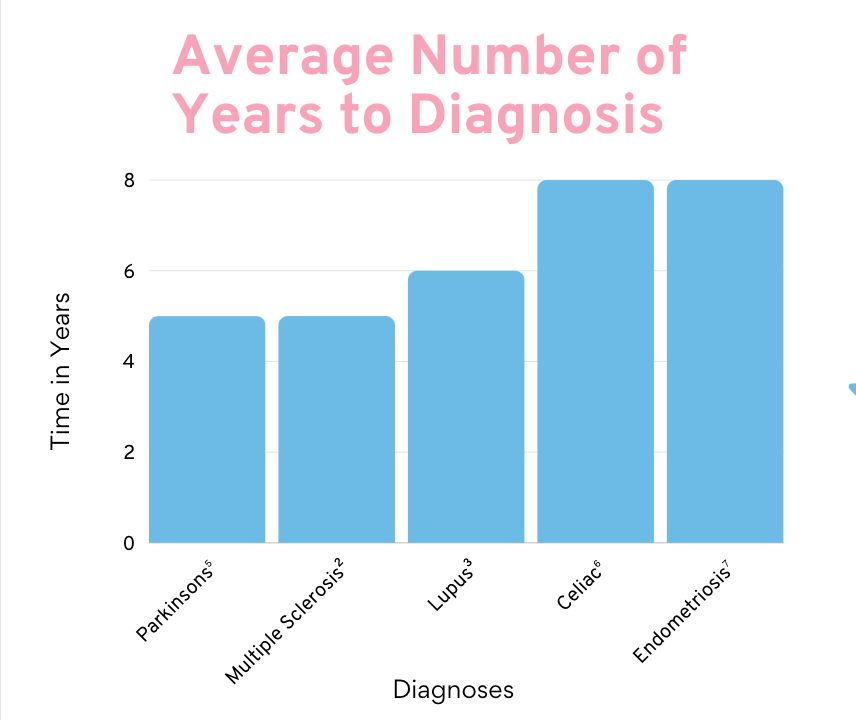

<!-- LINK TO TOP -->
<a name="readme-top"></a>

<!-- PROJECT SHIELDS -->
![contributors]
![forks]
![stars]
![issues]
![license]
![commits]
![lastcommit-shield]
![openprs]
![mergedprs]

<!-- PROJECT LOGO -->
<div align="center">
  <a href="https://example.com">
    
  </a>

<h3 align="center">Your Health Ally</h3>
<p align="center">
    Everyone deserves to be heard.
    <br />
    <br /> 
    <a href="">Give a Star</a>
    ·
    <a href="https://github.com/Ali-Herrera/your-health-ally/issues">Report a Bug</a>
    ·
    <a href="https://github.com/Ali-Herrera/your-health-ally/issues">Request a Feature</a>
  </p>
</div>

<!-- TABLE OF CONTENTS -->
<details>
<ol>
    <li>
    <a href="#about-the-project">About The Project</a>
        <ul>
            <li><a href="#description">Description</a></li>
            <li><a href="#features">Features</a></li>
            <li><a href="#built-with">Built With</a></li>
            <li><a href="#branches">Branches</a></li>
            <li><a href="#dev-reminders-&-issues">Dev Reminders</a></li>
        </ul>
    </li>
    <li>
      <a href="#getting-started">Getting Started</a>
      <ul>
        <li><a href="#prerequisites">Prerequisites</a></li>
        <li><a href="#installation">Installation</a></li>
      </ul>
    </li>
    <li><a href="#npm-scripts">NPM Scripts</a>
        <ul>
        <li><a href="#development">Development</a></li>
        <li><a href="#build"></a>Build</li>
        <li><a href="#start">Start</a></li>
        <li><a href="#test">Test</a></li>
        <li><a href="#eslint">ESLint</a></li>
        <li><a href="#other-scripts">Other Scripts</a></li>
      </ul>
    </li>
    <li><a href="#usage">Usage</a></li>
    <li><a href="#contributing">Contributing</a></li>
    <li><a href="#license">License</a></li>
    <li><a href="#acknowledgments">Acknowledgments</a></li>
    <li><a href="#citations">Citations</a></li>
  </ol>
</details>

<!-- About the Project -->
## About the Project

<p align="center">
    <!-- TODO: Replace link with deployed site -->
    <a href="https://www.youtube.com/watch?v=dQw4w9WgXcQ"> Deployed App </a>
    🔭
    <a href="https://github.com/Ali-Herrera/your-health-ally"> GitHub Repository</a>
</p>

### Description
**Your Health Ally** is an app designed to transform the way our users approach and manage their health by:
- Empower users to advocate for their well-being 
- Provide comprehensive information, resources, and tools, such as,
    - Types of doctors to see
    - Questions to bring to doctor
    - A checklist to prepare for office or virtual visits 

A study in 2022[^1] found that <strong>52%</strong> of individuals in the U.S. feel their symptoms are ignored, dismissed, or not believed when seeking medical treatment; <strong>50%</strong> of those respondents also reported that "a healthcare provider assuming something about me without asking me." [^1]

These numbers rise dependent on:
- race & ethnicity
- sexual orientation (LGBTQIA+ community)
- gender identity (female, transgender and non-binary individuals)
- chronic health conditions
- disabilities[^1]

Additionally, the Journal of General Internal Medicine found that on average, patients get **11 seconds** to explain the reason for their visit **before** they are interrupted by their doctors [^4]. This can lead to delays in proper diagnosis and treatment for patients.


[^2] [^3] [^7] [^7]

<p align="right">(<a href="#readme-top">back to top</a>)</p>

### Features
***Your Health App**'s features will include:
- Responsive design
- Intuitive navigation
- Authentication
- AI Chat Bot
- Interactive Glossary
- Chat-to-PDF Conversion

### Built With

**Mantine Next.js Template**

Created via [Mantine]([mantine-url]) `next-app-template` with [![next-shield]][next-url] `app router`.

To view the `next-app-template` template, click [here](https://github.com/mantinedev/next-app-template).

To view all of Mantine's templates and installation guides, click [here](https://mantine.dev/getting-started/).

**Languages and Runtimes**
[[!ts-shield]][ts-url]
[![js-shield]][js-url]
[![node-shield]][node-url]

**Frameworks & Libraries**
[![eslint-shield]](eslint-url)  setup with [eslint-config-mantine](https://github.com/mantinedev/eslint-config-mantine)
[![jest-shield]](just-url) setup with [React Testing Library](https://testing-library.com/docs/react-testing-library/intro)
[![npm-shield]][npm-url]
[![postcss-shield]][postcss-url] with [mantine-postcss-preset](https://mantine.dev/styles/postcss-preset)
[![storybook-shield]][storybook-url]

**APIs**
[![chatgbt-shield]][chatgbt-url]
[``]()
[``]()

**Backing Services**
[![mongodb-shield]][mongodb-url]

**Deployment Service**
[vercel-shield]

**DevOps**
[git-shield]

### Dev Reminders

**Mantine**'s `/hooks`, `/form` and `/core` components and their props, or any `React` hooks must be imported at the top of each file. Example below:

  ```
    import { useState } from 'react';
    import { useInputState, useMediaQuery } from '@mantine/hooks';
    import { useForm } from '@mantine/form';
    import { TextInput, NumberInput, Group, Text, ActionIcon } from '@mantine/core';
  ```

When importing an `ActionIcon` with Mantine, you must also import the graphic from Tabler (see below). You can search for icons at [https://tabler.io/icons](https://tabler.io/icons).

  ```
  import { IconBrandLinkedin } from "@tabler/icons-react";
  ```
<p align="right">(<a href="#readme-top">back to top</a>)</p>

<!-- GETTING STARTED -->
## Getting Started

### Prerequisites

1. [![node-shield]][node-url]
- Run `node -v` command to see if you already have Node.js installed and check the installed version.
- [Follow Node.js docs to download.](https://nodejs.org/en/download/)
- Once downloaded, run `node -v` command to double check its there.

2. [![npm-shield]][npm-url]
- Run `npm -v` command to see if you already have `npm` installed and check the installed version.
- [Follow npm docs to create an account and to download.](https://docs.npmjs.com/about-npm)
- Once downloaded, run `npm -v` command to double check its there.
- [Differences Between Yarn and NPM](https://www.knowledgehut.com/blog/web-development/yarn-vs-npm#differences-between-yarn-and-npm%C2%A0)

<p align="right">(<a href="#readme-top">back to top</a>)</p>

<!-- INSTALLATION -->
## NPM Scripts

### Development

- `npm run dev` to start the dev server at `http://localhost:3000/` during the app's development stage.

### Build

- `npm run build` to generate an optimized version of the app for production. _Note: this runs the NEXTJS `next build` command; [See Next.js docs for more.](https://nextjs.org/docs/app/api-reference/next-cli#build)_
- `npm run analyze` – analyzes application bundle with [@next/bundle-analyzer](https://www.npmjs.com/package/@next/bundle-analyzer)

### Start

The app must be compiled with `npm run build` **before** you're able to run the command script `npm run start` to start the app in production mode. _Note: this runs the NEXTJS `next start` command.[See Next.js docs for more.](https://nextjs.org/docs/pages/building-your-application/deploying)_

### Test

- `npm run typecheck` – checks TypeScript types
- `lint` – runs ESLint
- `prettier:check` – checks files with Prettier
- `jest` – runs jest tests
- `jest:watch` – starts jest watch
- `test` – runs `jest`, `prettier:check`, `lint` and `typecheck` scripts

### ESLint

- `npm run lint` every time you want to run ESLint to catch errors. _Note: this runs the NEXTJS `next lint`command; [See Next.js docs for more.](https://nextjs.org/docs/app/api-reference/next-cli#lint)_

### Other Scripts

- `storybook` – starts storybook dev server
- `storybook:build` – build production storybook bundle to `storybook-static`
- `prettier:write` – formats all files with Prettier

<p align="right">(<a href="#readme-top">back to top</a>)</p>

<!-- USAGE EXAMPLES -->
## Usage

Use this space to show useful examples of how a project can be used. Additional screenshots, code examples and demos work well in this space. You may also link to more resources.

_For more examples, please refer to the [Documentation](https://example.com)_

<p align="right">(<a href="#readme-top">back to top</a>)</p>

<!-- CONTRIBUTING -->
## Contributing

[![portfolio-ali-shield]][portfolio-ali-url]
| [Contact][email-ali] |  [GitHub][github-ali-url] [Medium][medium-ali-url] |

[![portfolio-victoria-shield]][portfolio--url]
| [Contact][email-victoria] | [GitHub][github-victoria-url] | [Medium][medium-victoria-url] |

<p align="right">(<a href="#readme-top">back to top</a>)</p>

<!-- LICENSE -->
## License

Distributed under the MIT License. See [`LICENSE.txt`](license-url) for more information.

<p align="right">(<a href="#readme-top">back to top</a>)</p>

<!-- ACKNOWLEDGEMENTS -->
## Acknowledgements

**Design Tools**
[``]()
[``]()
[``]()

**Project Management Tools**
[`ClickUp`](https://clickup.com/?noRedirect=true&_gl=1*ndl932*_gcl_au*NjgwMjEzNTEwLjE3MDY5MDU0NTAuMTgyMjU5MDI2Ny4xNzA2OTA1NDY3LjE3MDY5MDU1MTE.)
[`Milanote`](https://www.milanote.com/refer/rcEpkqyVyNt7y3JS1C)
[`Slack`]()
[``]()

**Other**
- [Best README Template](https://github.com/othneildrew/Best-README-Template/blob/master/README.md#roadmap)
- [GitHub Emoji Cheat Sheet](https://www.webpagefx.com/tools/emoji-cheat-sheet)
- [Img Shields](https://shields.io)

<p align="right">(<a href="#readme-top">back to top</a>)</p>

<!-- CITATIONS -->
## Citations
[^1]: Harris poll: Many patients feel ignored or doubted when seeking medical treatment  . MITRE. (2022, December 20). https://www.mitre.org/news-insights/news-release/mitre-harris-poll-many-patients-feel-ignored-or-doubted#:~:text=MCLEAN%2C%20Va.%2C%20%26%20BEDFORD,believed%E2%80%9D%20when%20seeking%20medical%20treatment
[^2]: Ibrahim, A. (2021, September 1). Signs of ms may start five years before diagnosis. MS International Federation. https://www.msif.org/news/2018/08/26/signs-of-ms-may-start-five-years-before-diagnosis/
[^3]: Lupus facts and statistics. Lupus Foundation of America. (n.d.). https://www.lupus.org/resources/lupus-facts-and-statistics#:~:text=Lupus%20symptoms%20can%20also%20be,first%20notice%20their%20lupus%20symptoms.
[^4]: Singh Ospina, N., Phillips, K.A., Rodriguez-Gutierrez, R. et al. Eliciting the Patient’s Agenda- Secondary Analysis of Recorded Clinical Encounters. J GEN INTERN MED 34, 36–40 (2019). https://doi.org/10.1007/s11606-018-4540-5
[^5]: Ten early signs. Parkinson’s Foundation. (n.d.). https://www.parkinson.org/understanding-parkinsons/10-early-signs
[^6]: Twenty things you might not know about celiac disease. Celiac Disease Foundation. (2022, August 24). https://celiac.org/about-the-foundation/featured-news/2016/08/20-things-you-might-not-know-about-celiac-disease/#:~:text=There%20is%20an%20average%20delay,miscarriage%2C%20epilepsy%2C%20and%20more.
[^7]: Yale Medicine. (2024, January 19). Endometriosis. Yale Medicine. https://www.yalemedicine.org/conditions/endometriosis#:~:text=On%20average%2C%20women%20in%20the,are%20found%20to%20have%20it.

<p align="right">(<a href="#readme-top">back to top</a>)</p>


<!-- MARKDOWN LINKS & IMAGES -->
<!--
*** I'm using markdown "reference style" links for readability.
*** Reference links are enclosed in brackets [ ] instead of parentheses ( ).
*** See the bottom of this document for the declaration of the reference variables
*** for contributors-url, forks-url, etc. This is an optional, concise syntax you may use.
*** https://www.markdownguide.org/basic-syntax/#reference-style-links
-->

<!-- REPO MD REFERENCE -->
<!-- https://flat.badgen.net/ -->
<!-- Ali-Herrera/your-health-ally -->
[branches]: https://flat.badgen.net/github/branches/Ali-Herrera/your-health-ally
[commits]:  https://flat.badgen.net/github/commits/Ali-Herrera/your-health-ally
[issues]: https://bflat.badgen.net/github/issues/Ali-Herrera/your-health-ally
[openissues]: https://bflat.badgen.net/github/open-issues/Ali-Herrera/your-health-ally
[contributors]: https://flat.badgen.net/github/contributors/Ali-Herrera/your-health-ally#1ecbe1
[forks]: https://flat.badgen.net/github/forks/
[lastcommit-shield]: https://flat.badgen.net/github/last-commit/Ali-Herrera/your-health-ally
[mergedprs]: https://flat.badgen.net/github/merged-prs/Ali-Herrera/your-health-ally
[openprs]: https://flat.badgen.net/github/open-prs/Ali-Herrera/your-health-ally
[stars]: https://flat.badgen.net/github/stars/Ali-Herrera/your-health-ally

<!-- MIT -->
[license-shield]: https://flat.badgen.net/github//license/Ali-Herrera/your-health-ally
[license-url]:https://github.com/Ali-Herrera/your-health-ally/blob/main/LICENCE


<!-- IMAGES MD REFERENCE -->


<!-- SOCIAL & CONTACT MD REFERENCE -->
[gmail-ali]: alisonherrera02@gmail.com
[gmail-victoria]: vmcnorrill@gmail.com
[medium-ali-url]: https://medium.com/@alisonherrera02
[medium-victoria-url]: https://medium.com/@vmcnorrill
[portfolio-ali-shield]: https://img.shields.io/badge/Ali%20Herrera-f36b6d?style=for-the-badge
[portfolio-ali-url]: https://alisonherrera.com/
[portfolio-victoria-shield]: https://img.shields.io/badge/Victoria%20McNorrill-EE583F?style=for-the-badge
[portfolio-victoria-url]: https://www.victoriamcodes.com/
[github-ali-url]: https://github.com/Ali-Herrera
[github-victoria-url]: https://github.com/victoriamcn


<!-- STACK MD REFERENCE -->
<!-- [-shield]:
[-url] -->
[apollographql-shield]: https://img.shields.io/badge/-ApolloGraphQL-311C87?style=for-the-badge&logo=apollo-graphql
[apollographql-url]: https://www.apollographql.com/docs/
[chatgbt-shield]: https://img.shields.io/badge/chatGPT-74aa9c?style=for-the-badge&logo=openai&logoColor=white
[chatgbt-url]: https://openai.com/blog/introducing-chatgpt-and-whisper-apis
[eslint-shield]: https://img.shields.io/badge/eslint-3A33D1?style=for-the-badge&logo=eslint&logoColor=white
[eslint-url]: https://eslint.org/docs/latest/
[git-shield]: https://img.shields.io/badge/git-%23F05033.svg?style=for-the-badge&logo=git&logoColor=white
[git-url]: https://git-scm.com/doc
[github-shield]: https://img.shields.io/badge/GitHub-100000?style=for-the-badge&logo=github&logoColor=white
[github-url]: https://www.github.com/
[js-shield]: https://img.shields.io/badge/JavaScript-323330?style=for-the-badge&logo=javascript&logoColor=F7DF1E
[js-url]: https://www.javascript.com/
[jest-shield]: https://img.shields.io/badge/-jest-%23C21325?style=for-the-badge&logo=jest&logoColor=white
[jest-url]: https://jestjs.io/)
[mantine-shield]: https://img.shields.io/badge/MantineUI-3a9ced?style=for-the-badge
[mantine-url]: https://mantine.dev/
[mongodb-shield]: https://img.shields.io/badge/MongoDB-%234ea94b.svg?style=for-the-badge&logo=mongodb&logoColor=white
[mongodb-url]: https://www.mongodb.com/
[mongoose-shield]: https://img.shields.io/badge/mongoosejs-87030a?style=for-the-badge
[mongoose-url]: https://mongoosejs.com/docs/index.html
[next-shield]: https://img.shields.io/badge/next.js-000000?style=for-the-badge&logo=nextdotjs&logoColor=white
[next-url]: https://nextjs.org/
[node-shield]: https://img.shields.io/badge/node.js-6DA55F?style=for-the-badge&logo=node.js&logoColor=white
[node-url]: https://nodejs.org/en
[npm-shield]: https://img.shields.io/badge/NPM-%23CB3837.svg?style=for-the-badge&logo=npm&logoColor=white
[npm-url]: https://www.npmjs.com/
[react-shield]: https://img.shields.io/badge/React-20232A?style=for-the-badge&logo=react&logoColor=61DAFB
[react-url]: https://reactjs.org/
[postcss-shield]: https://img.shields.io/badge/postcss-DD3A0A?style=for-the-badge&logo=postcss&logoColor=white
[postcss-url]: https://postcss.org/
[prettier-shield]: https://img.shields.io/badge/prettier-1A2C34?style=for-the-badge&logo=prettier&logoColor=F7BA3E
[prettier-url]: https://prettier.io/
[storybook-shield]: https://img.shields.io/badge/-Storybook-FF4785?style=for-the-badge&logo=storybook&logoColor=white
[storybook-url]:https://storybook.js.org/
[ts-shield]: https://img.shields.io/badge/typescript-%23007ACC.svg?style=for-the-badge&logo=typescript&logoColor=white
[ts-url]: https://www.typescriptlang.org/
[vercel-shield]: https://img.shields.io/badge/vercel-%23000000.svg?style=for-the-badge&logo=vercel&logoColor=white
[vercel-url]: https://vercel.com/